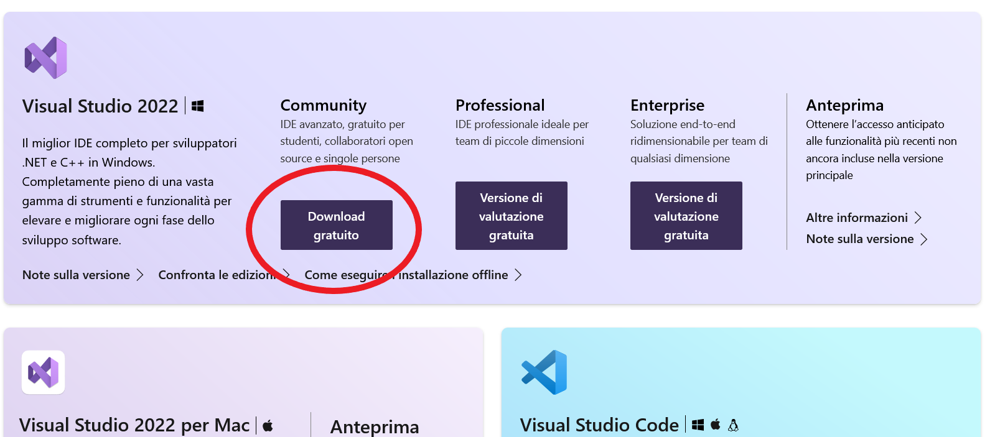

# Guida all'installazione di .NET e C# 10

### Introduzione

In questa guida spiegherò come installare gli strumenti per lo sviluppo di C#.
Strumenti che verranno installati:

* .NET
* Visual Studio Community
  * Packages
  * Estensioni
* Altri strumenti
### .NET

#### Installazione

Scaricare ed installare l'ultima versione SDK di .NET
[Microsoft .NET SDK Download](https://dotnet.microsoft.com/en-us/download)


Controllare l'installazione da terminale eseguendo il comando

```batch
dotnet --list-sdks
```


### Visual Studio

#### Download

Scaricare dal link seguente l'ultima versione dell'installer di Visual Studio Community Edition:
[Visual Studio Community Installer Download](https://visualstudio.microsoft.com/it/downloads/)



Aprire il file `VisualStudioSetup.exe` ed eseguire le istruzioni seguenti

#### Impostazioni Installer

##### Pacchetti

Selezionare i seguenti pacchetti:

* Sviluppo ASP.NET e Web
* Sviluppo per Desktop .NET
* Elaborazione ed archiviazione dati


##### Lingua

Selezionare lingua **Inglese**[^1] (English) e Italiano (opzionale)


#### Estensioni

Lista di estensioni di Visual Studio da installare:

[Blazor Extensions - Syncfusion ](https://marketplace.visualstudio.com/items?itemName=SyncfusionInc.BlazorVSExtension)
: Estensione Blazor Per utilizzare i componenti SyncFusion Blazor.

[Restart Visual Studio for vs2022 preview](https://marketplace.visualstudio.com/items?itemName=pedoc.RestartVisualStudioforvs2022preview)
: Aggiunge `Restart Visual Studio` al menù _File_. Molto utile per risolvere velocemente problemi casuali causati da VS <sub>(potrebbero essere molti)</sub>.

### Altro

#### Estensioni per il browser

FFS MSDN in English [Chrome](https://chrome.google.com/webstore/detail/ffs-msdn-in-english/ddaknggefjjgpnlhiejepbiplceedmfl)|[Firefox](https://addons.mozilla.org/en-US/firefox/addon/ffs-msdn-in-english/)
: Estensione per forzare la documentazione online di Microsoft in Inglese[^2].

[^1]: L'inglese è **fortemente** consigliato poichè le traduzioni sono fatte attraverso traduttori automatici **veramente** poco affidabili.

[^2]: Vedi sopra.
