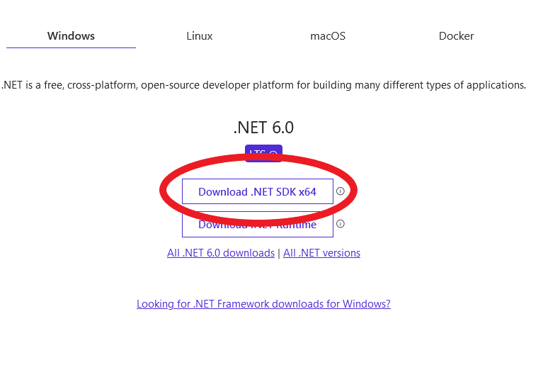

# Guida all'installazione di .NET e C# 10 <!-- omit in toc -->

- [1. Introduzione](#1-introduzione)
- [2. .NET](#2-net)
  - [2.1. Installazione](#21-installazione)
- [3. Visual Studio](#3-visual-studio)
  - [3.1. Download](#31-download)
  - [3.2. Impostazioni Installer](#32-impostazioni-installer)
    - [3.2.1. Pacchetti](#321-pacchetti)
    - [3.2.2. Lingua](#322-lingua)
  - [3.3. Estensioni](#33-estensioni)
- [4. Git & Git](#4-git--git)
  - [4.1. Download & Link](#41-download--link)
  - [4.2. Installazione Git](#42-installazione-git)
- [5. Altro](#5-altro)
  - [5.1. Programmi](#51-programmi)
  - [5.2. Estensioni per il browser](#52-estensioni-per-il-browser)

## 1. Introduzione

Strumenti che verranno installati:

- .NET
- Visual Studio Community
  - Packages
  - Estensioni
- Altri strumenti

## 2. .NET

.NET è il framework per eseguire codice C#; è necessario installare lo SDK per poter compilarlo.

### 2.1. Installazione

Scaricare ed installare l'ultima versione SDK di .NET
[Microsoft .NET SDK Download](https://dotnet.microsoft.com/en-us/download)



Controllare l'installazione da terminale eseguendo il comando

```batch
dotnet --list-sdks
```


## 3. Visual Studio

Visual studio è l'IDE standard per la programmazione in C#.

### 3.1. Download

Scaricare dal link seguente l'ultima versione dell'installer di Visual Studio Community Edition:

[Visual Studio Community Installer Download](https://visualstudio.microsoft.com/it/downloads/)


Aprire il file `VisualStudioSetup.exe` ed eseguire le istruzioni seguenti

### 3.2. Impostazioni Installer

È importante selezionare i pacchetti giusti. È possibile in seguito all'installazione modificare i pacchetti installati cercado su start `Visual Studio Installer`.

#### 3.2.1. Pacchetti

Selezionare i seguenti pacchetti:

- Sviluppo ASP.NET e Web
- Sviluppo per Desktop .NET
- Elaborazione ed archiviazione dati


#### 3.2.2. Lingua

Selezionare lingua **Inglese**[^1] (English) e Italiano (opzionale)


### 3.3. Estensioni

Lista di estensioni di Visual Studio da installare:

[Blazor Extensions - Syncfusion](https://marketplace.visualstudio.com/items?itemName=SyncfusionInc.BlazorVSExtension)
: Estensione Blazor per utilizzare i componenti SyncFusion Blazor.

[Restart Visual Studio for vs2022 preview](https://marketplace.visualstudio.com/items?itemName=pedoc.RestartVisualStudioforvs2022preview)
: Aggiunge `Restart Visual Studio` al menù _File_. Molto utile per risolvere velocemente alcuni problemi casuali causati da VS <sub>(potrebbero essere molti)</sub>.

## 4. Git & Git

  Git è un software VCS (Version Control System) locale che permette agli sviluppatori di salvare istantanee dei loro progetti nel tempo. In genere è meglio per l’uso individuale.

  GitHub è una piattaforma web che incorpora le funzionalità di controllo di versione di git e quindi può essere usata in modo collaborativo. Include anche funzioni di gestione di progetto e del team, oltre a opportunità di networking e di social coding.

### 4.1. Download & Link

[Git Download](https://git-scm.com/downloads)

[Git Documentation](https://git-scm.com/doc)

[GitHub](https://github.com)

### 4.2. Installazione Git

👷‍♂️ _Work In Progress_ 👷‍♂️

## 5. Altro

### 5.1. Programmi

Notepad++
: Utile per visualizzare e modificare qualsiasi file di testo.
[Download](https://notepad-plus-plus.org/downloads/)

Visual Studio Code
: IDE molto versatile ed estendibile.
[Download](https://code.visualstudio.com/)

Insomnia
: Strumento di test REST API.
[Download](https://insomnia.rest/download)

### 5.2. Estensioni per il browser

FFS MSDN in English [Chrome](https://chrome.google.com/webstore/detail/ffs-msdn-in-english/ddaknggefjjgpnlhiejepbiplceedmfl) | [Firefox](https://addons.mozilla.org/en-US/firefox/addon/ffs-msdn-in-english/)
: Estensione per forzare la documentazione online di Microsoft in Inglese[^2].

----
[^1]: L'inglese è **fortemente** consigliato poichè le traduzioni sono fatte attraverso traduttori automatici <ins>**veramente**</ins> poco affidabili.

[^2]: Vedi sopra.
